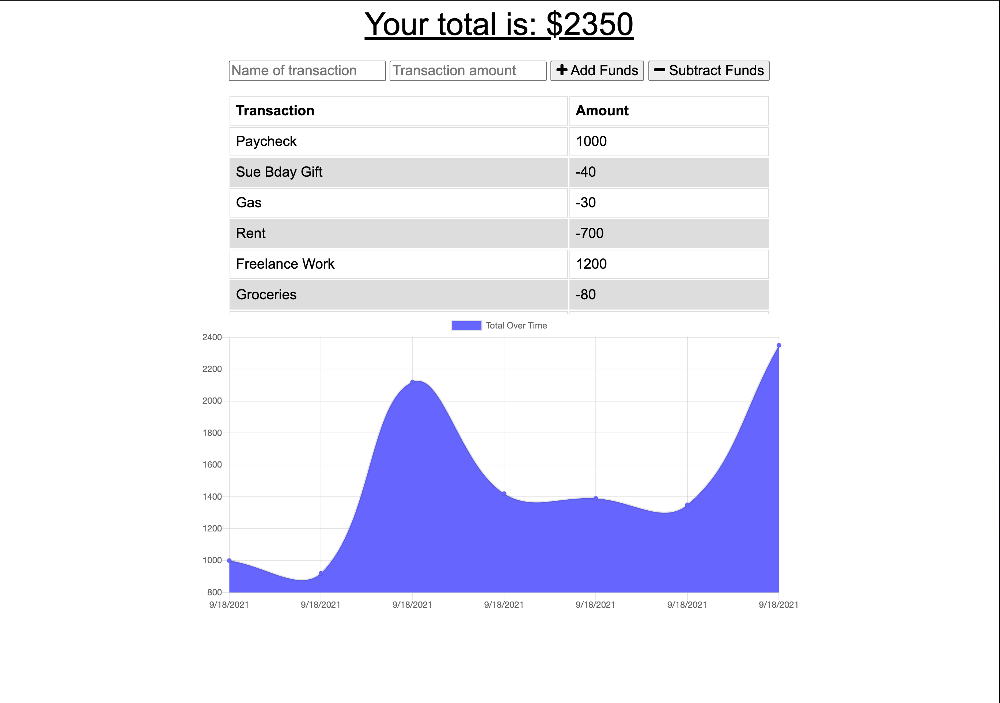
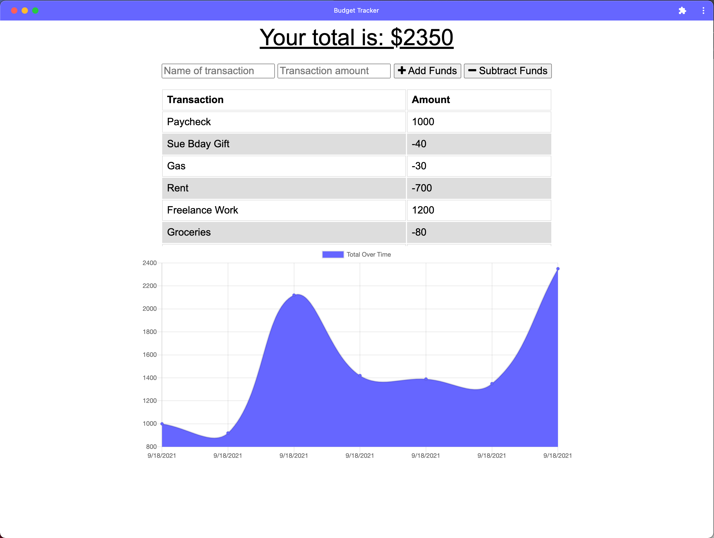

# Budget Tracker
## Progressive Web Application Challenge

## Description
This weeks challenge is to create a Progressive Web Application, PWA. A PWA is a web application that can function like a mobile app, and maintain functionality when a user is experiencing slow internet or completely offline. This functionality is demonstrated with a budget tracker. Users can add expences or make deposits without worrying about their internet connection. This app uses Express.js for server routing, MongoDB to perform CRUD operations, a service worker to cache critical pages for offline functionality, a web manifest that acts as a blueprint when installing the app to a users device, and IndexedDB for client-side data storage. As well as the Node.js middleware packages, morgan and compression. This app is deployed to Heroku using MongoDB Atlas. 

View deployed application, hosted on Heroku: https://budget-tracker-pwa-eh.herokuapp.com/ 

## Table of Contents
* [Installation](#installation)
* [Usage](#usage)
* [Screenshots](#screenshots)
* [Questions](#questions)

## Installation
To install any necessary dependencies run the following command: 

    npm install

## Usage 
For local usage, clone the repo on you local manchine and open in an IDE. If you haven't already, make sure you have node.js installed as well as npm (check installation: `node -v` & `npm -v`). In the packages root directory, run `npm i` to install the necessary dependencies. Installed dependencies include: mongoose.js, express.js, morgan, and compression. Once all dependencies are installed, run `npm start` to initiate the application. 
To install the app to a device, open the [app](https://budget-tracker-pwa-eh.herokuapp.com/) in a web browser; the icon to install the app should appear in the URL address bar.

## Screenshots
Web Client: 

Desktop App:

## Questions
If you have any questions or feedback, create a new issue and add the label "question". 
View more of my work: [github.com/emholmes](https://github.com/emholmes).
